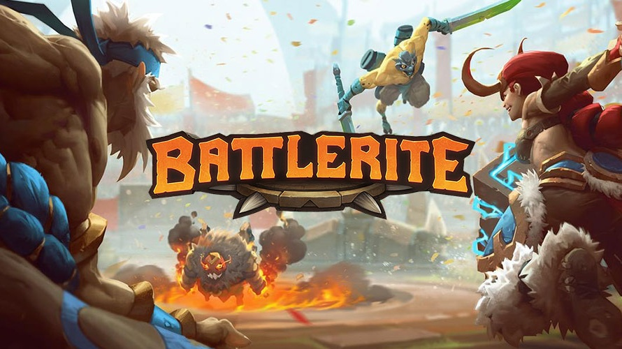
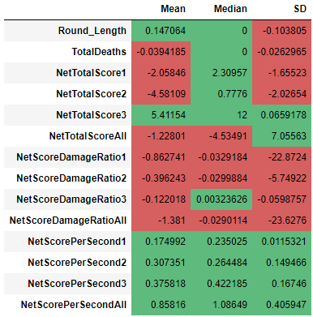
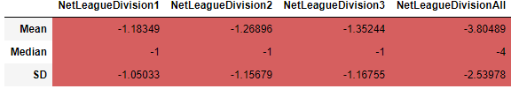
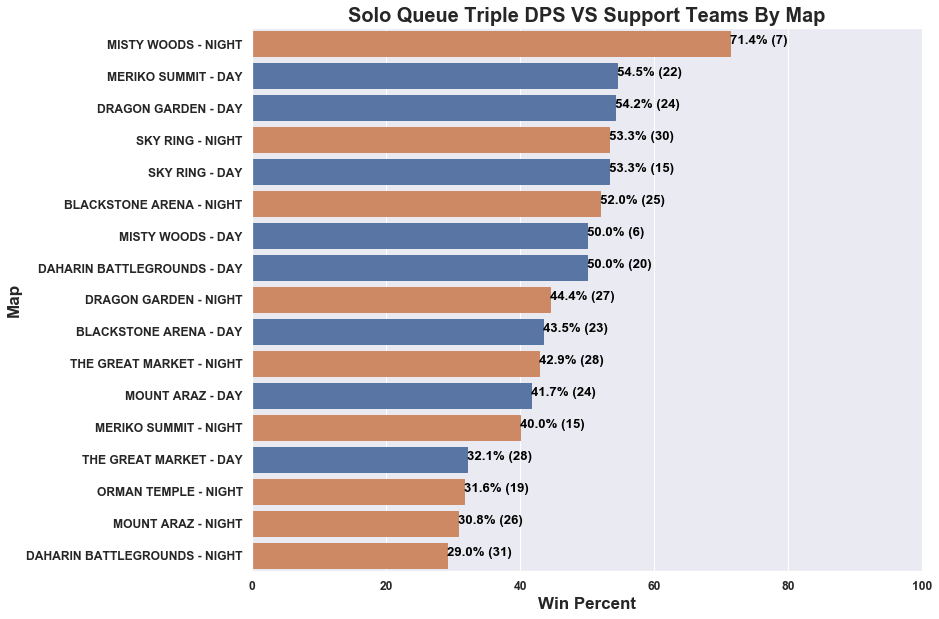
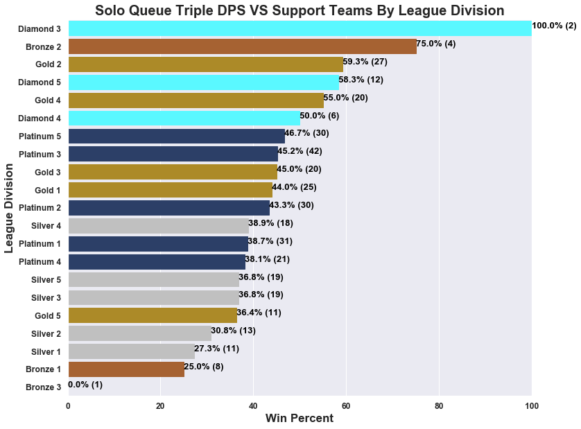
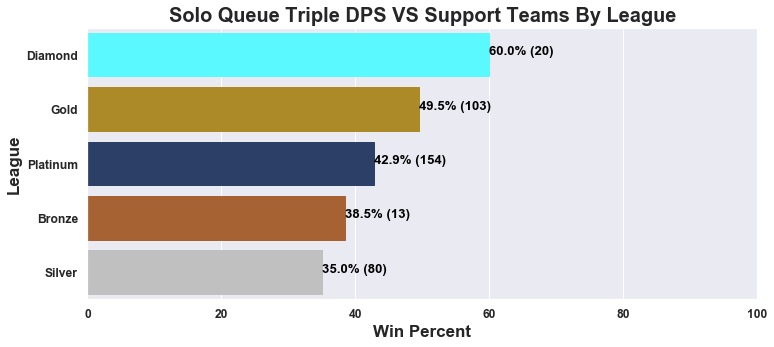
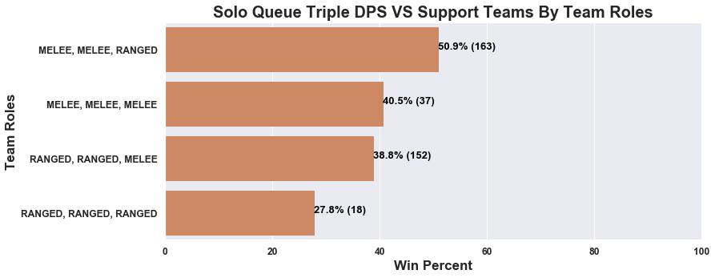
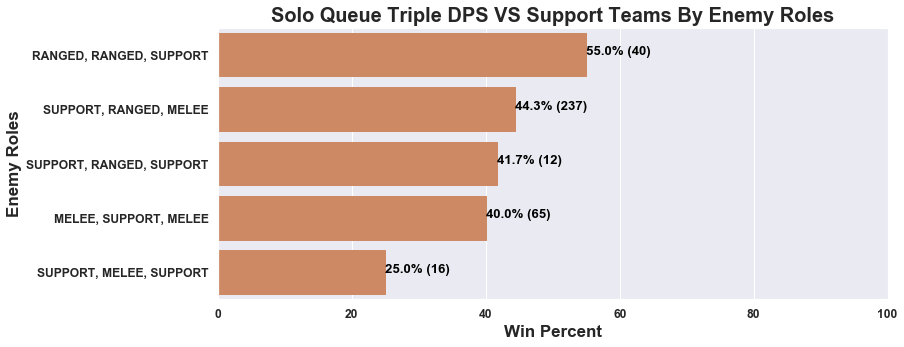
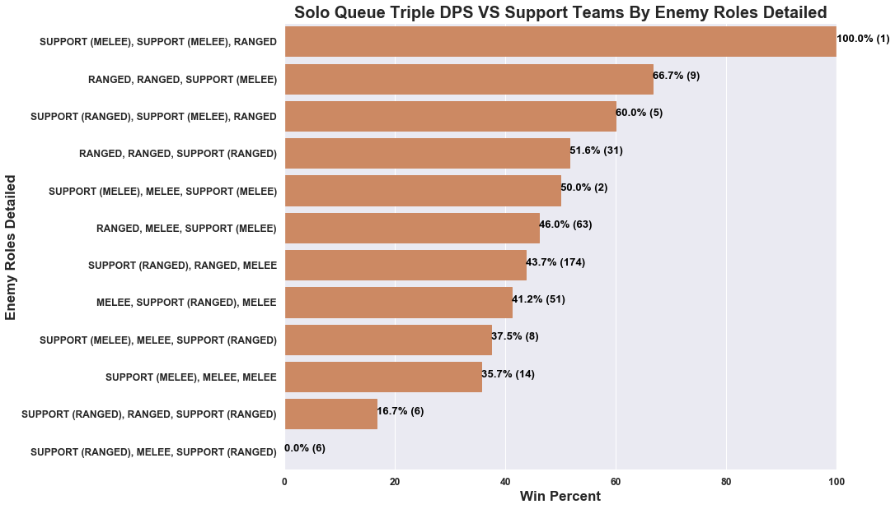

## **Introduction**

This post assumes that you're already familiar with the mechanics of the game.

For those who are not familiar, Battlerite is a free-to-play Multiplayer Online Battle Arena (MOBA) brawler game available on 
[Steam](https://store.steampowered.com/app/504370/Battlerite/).

Here is a helpful [resource](https://segmentnext.com/2017/11/27/battlerite-beginners-guide/) for complete beginners.

See my [YouTube](https://www.youtube.com/user/Skywind555/videos) channel for sample gameplay footage.

---

The data I'm using is from the Battlerite API collected around July 11 2019 right before API shutdown.

Details of how I collected the data from the API is available [here](https://github.com/Skywind555/Battlerite) for those interested.

For details of how I processed the data to be used in the analysis go.

---

Due to a fairly large dataset with many columns, there are an endless number of questions to answer, though the data is
fairly outdated and covers only a day or two of games. It's also from a previous patch and from the beginning of a new season, 
so this means that the results of any analysis may not be applicable to the current state of the game. 

Nonetheless, I came up with a list of possibly interesting questions that could be answered given the limitations of the data. 
I asked a handful of old and current Battlerite players which questions they were most interested in.

These focus questions are:

1. Does strict matchmaking actually improve the quality of matches?

2. How often does Triple DPS teams win against support teams in solo queue?

3. What are the most important features to determine the outcome of a round?

## **Does strict matchmaking actually improve the quality of matches?**

For this question, only solo queue is considered.

Most players opt not to use the strict matchmaking feature because it increases an already long queue time. This holds especially
true for higher ranked players. In the end, does the feature really improve the quality of games?

First, how do we define "quality" in this instance? There could be three different ways to look at match quality.

1. How close are the matches?

2. How close are the rounds?

3. How spread apart are the player's league ranks?

### **How close are the matches?**

Was the game a 3-0 victory? Or was it a 3-1 or 3-2? The latter indicates that the teams were more evenly matched.

Because a 3-0 and 0-3 game is the same thing, we can say that a 3-0 or 0-3 has a round differential of 3, a 3-1 or 1-3 has a
round differential of 2, and a 3-2 or 2-3 has a round differential of 1.

As it turns out, if we look at games with at least 1 player who selected strict matchmaking, the average round differential
is 2.15 and for games with no players who selected strict matchmaking, the average round differential is 2.24.

Since 2.15 < 2.24, this shows that on average, strict matchmaking games has more instances of 3-1/1-3 and 3-2/2-3 outcomes
compared to regular matchmaking games.

### **How close are the rounds?**

Does each round involve one team completely dominating the other one or is it more evenly matched? Despite if a game outcome
is a 3-0/0-3, the rounds themselves can still be close if both teams are scoring high and the rounds go to fog, for an example.

Here is some background information before we examine a table that summarizes the differences between 
strict match making games and regular games.

TotalDeaths measures the total number of deaths in a round.

NetTotalScore metrics calculates the difference between the score from a member on the team and the score from the enemy player.

1 refers to the highest scoring player, 2 refers to the second highest scoring player, and 3 refers to the lowest scoring player.

So, NetTotalScore1 measures the score difference between top scoring players for each side. The absolute value is taken, so
the sign does not matter.

Since the table takes strict - not strict, negative values indicate that the regular matchmaking group is higher.

"All" related rows calculates an average for the team and enemy to compute the value.

ScoreDamageRatio is defined as total score divided by damage taken. So, NetScoreDamageRatio1 calculates the difference between the
ScoreDamageRatio of the highest scoring player on each team.

ScorePerSecond is defined as total score divided by how long the player survived in seconds.

SD stands for standard deviation.

For Round Length, 0.147 seconds is fairly insignificant, but it does hold true that rounds from strict matchmaking
games on average is slightly longer than rounds from regular matchmaking games. However, it does not necessarily mean that
more rounds go to fog in a strict matchmaking game. The negative SD value also shows that strict games are more consistent in the
time in each round.

The TotalDeaths value is negative, indicating that more deaths occur in a regular game. This also implies that 1v1 and 2v2 situations
happen less often in strict matchmaking games which makes sense because there are less "weak links" to abuse from the other team.

The positive NetTotalScore3 value implies that the difference between the lowest scoring player of each team is bigger in strict
games compared to regular games. This is a bit counterintuitive, but NetTotalScore is not a good measurement to determine the
closeness of rounds because it's going to vary depending on round length.

NetScorePerSecond metrics in general are not a great metric for determining the closeness of rounds because higher values does not
mean one player or team is better than the other. For an example, one player could be poorly utilziing their defensive abilities
but landing all their damage abilities. This results in a quick death due to being focused by all players on the opposing team.
But, their ScorePerSecond metric will be high.

Damage taken in respect to score, however, is a good metric for determining the closeness of rounds. For an example in a 1v1
situation, if both players take a similar amount of damage, in most cases the surviving player will be closer to death. Though,
this does not hold entirely true because of health orbs and middle orb. But, when we see that the surviving player is closer to
death we are quick to think, "Wow, that was close!"

The nearly consistent negative values in the first two columns for NetScoreDamageRatio1, NetScoreDamageRatio2, NetScoreDamageRatio3,
and NetScoreDamageRatioAll show that these values are larger in the regular matchmaking group. This in turn illustrates on average, 
one team in regular matchmaking games are taking less damage than the other team while taking score into account. 

In turn, this implies that for strict games, players on both teams take more similar amounts of damage for how much they score.
This indirectly shows that players are more evenly matched.

### **How spread apart are the players' league ranks?**

We should see all negative values in this table based on the way strict matchmaking works. Similar to the last table,
NetLeagueDivision1 takes the absolute difference of their rank between the top scoring player of each team.

For reference, placement counts as 0, Bronze 5 counts as 1, and going up to Champion 1 mapping to 30. The highest rank in the
data was around Champion 3, so Grand Champion is not included. Placement counting as 0 is not completely ideal and because this is
the beginning of the new season, the true skill of players are not properly measured with their rank.

The consistently negative values confirm that the ranks are more spread apart in regular matchmaking games.

## **How often does Triple DPS teams win against support teams in solo queue?**

Often times in solo queue whenever you see that you don't have a support while the enemy team does, your immediate thought is,
"We lost, gg."

But how often do they really win against support teams? Does it differ by league, map, team comp, or enemy comp? Going a step further,
what are their possible win conditions for rounds?

Overall, the win rate of Triple DPS teams against a team with at least one support is about 44% in a sample size of 370 games.

### **By Map**

The best map is Misty Woods - Night resulting in a 71.4% chance to win, although the sample size is much lower compared to
most of the other maps. Meriko Summit - Day, Dragon Garden - Day, Sky Ring - Night, Sky Ring - Day, and Blackstone Arena - Night 
are strong contenders with all win percents > 50%.

Daharin Battlegrounds - Night, Mount Araz - Night, Orman Temple - Night, and The Great Market - Day are the worst maps with 
win percents < 40%.

As far as why these maps are better/worse than the other maps is not entirely clear as it can also be dependent on team 
comp vs enemy comp.

It may also be due to chance due to a relatively low sample size and slight bias because high rated players tend to 
avoid playing triple DPS whenever possible.

### **By League/Elo**

Again, due to low sample size, the results above are not too clear other than that a Triple DPS team averaging Diamond League
has the best chance to win because they understand the game better compared to lower league players. They know how to properly
punish players for their mistakes whereas a lower rated Triple DPS team may not be playing aggresive enough to take down
a team with a support.

Similar to the last plot, this shows that Triple DPS teams averaging Diamond league have the highest chance to win. Keep in mind
that this is the beginning of a new season and players in Diamond league are going to be closer in Grand Champion in skill level.

Bronze and Silver are consistently at the bottom which makes sense because they haven't learned how to play the game properly
yet.

It is somewhat strange that Gold league performs better then Platinum league. Personally, I do not know the major differences
between the players in these lower leagues, so I cannot say why this happens to be the case.

### **By Team Role**

The plot clearly shows that the best Triple DPS comp consists of two melee champions and one ranged champion. The worst is
Triple ranged.

### **By Enemy Role**

Triple DPS teams appears to perform best against double ranged support teams and the worst worst double support melee.

This may be due to the fact that double melee ranged is the most common triple DPS comp and from a comp perspective, that
should perform well against a double ranged comp regardless of actual champions.

Double melee has the ability to push double ranged comps back for mid control. It may also be more deadly for the enemy team if
their support is melee support such as Ulric or especially Sirius because it puts them at the frontlines. We know about that 
Space Q Sirius syndrome. 

Looking at the second highest result, double ranged support(melee) confirms the previous statement that a melee support with double
ranged performs poorly against a double melee comp. The win rate against a double ranged support (ranged) has about a 15%
reduction, but is still above 50%. Considering that the overall win rate for Triple DPS is 44%, this is good.

Although a fairly low sample size, it appears that Triple DPS teams do the worst against double support (ranged) melee or
double support (ranged) ranged.

For double support (ranged) ranged, the comp forces the Triple DPS team to engage and commit to do any real damage that isn't
outhealed. 

Triple DPS teams performs slightly better in this instance compared to double support (ranged) melee comp because
they can put forward pressure against the ranged champions for mid control. However, when the double support team (ranged)
has a melee player, it is not as easy to push them back, so this reflects in the lower win rate.

## **What are the possible win conditions for rounds?**

