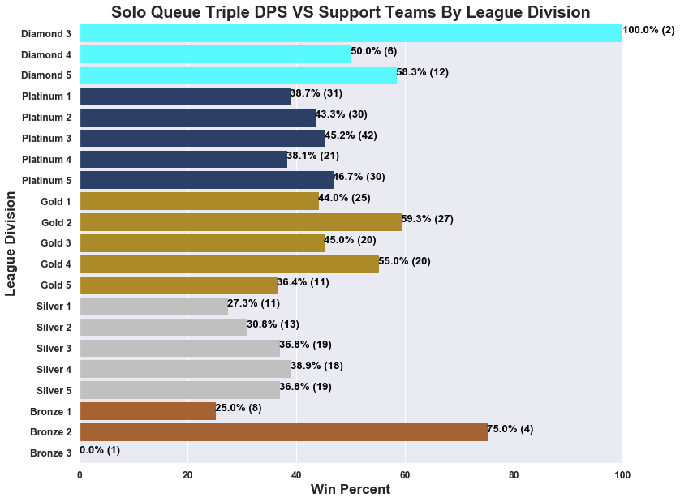
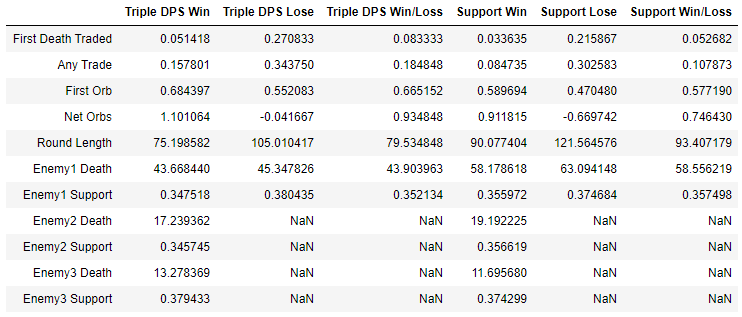

## **Introduction**

This post assumes that you're already familiar with the mechanics of the game.

For those who are not familiar, Battlerite is a free-to-play Multiplayer Online Battle Arena (MOBA) brawler game available on
[Steam](https://store.steampowered.com/app/504370/Battlerite/).

Here is a helpful [resource](https://segmentnext.com/2017/11/27/battlerite-beginners-guide/) for complete beginners.

See my [YouTube](https://www.youtube.com/user/Skywind555/videos) channel for sample gameplay footage.

---

The data I'm using is from the Battlerite API collected around July 11 2019 right before API shutdown.

Details of how I collected the data from the API is available [here](https://github.com/Skywind555/Battlerite) for those interested.

For technical details of how I processed the data to be used in the analysis go [here](https://nbviewer.jupyter.org/github/Skywind555/Battlerite/blob/master/Blog%20Post%20Data%20Analysis/BR%20Data%20Processing.ipynb).

For technical details of how I answered the first two questions in the analysis go [here](https://nbviewer.jupyter.org/github/Skywind555/Battlerite/blob/master/Blog%20Post%20Data%20Analysis/BR%20Data%20Analysis.ipynb).

For technical details of how I answered the last question go [here](https://nbviewer.jupyter.org/github/Skywind555/Battlerite/blob/master/Blog%20Post%20Data%20Analysis/BR%20Data%20Analysis%202.ipynb).

All the data and project files for this analysis is available in this [repository](https://github.com/Skywind555/Battlerite/tree/master/Blog%20Post%20Data%20Analysis).

---

Due to a fairly large data set with many columns, there are an endless number of questions to answer, though the data is
fairly outdated and covers only a day or two of games. It's also from a previous patch and from the beginning of a new season,
so this means that the results of any analysis may not be applicable to the current state of the game.

Nonetheless, I came up with a list of possibly interesting questions that could be answered given the limitations of the data.
I asked a handful of old and current Battlerite players which questions they were most interested in.

These focus questions are:

1. Does strict matchmaking actually improve the quality of matches?

2. How often do Triple DPS teams win against support teams in solo queue?

3. What are the most important features to determine the outcome of a round?

## **1. Does strict matchmaking actually improve the quality of matches?**

For this question, only solo queue is considered.

Most players opt not to use the strict matchmaking feature because it increases an already long queue time. This holds especially
true for higher ranked players. In the end, does the feature really improve the quality of games?

First, how do we define "quality" in this instance? There could be three different ways to look at match quality.

1. How close are the matches?

2. How close are the rounds?

3. How spread apart are the player's league ranks?

### **How close are the matches?**

Was the game a 3-0 victory? Or was it a 3-1 or 3-2? The latter indicates that the teams were more evenly matched.

Because a 3-0 and 0-3 game is the same thing, we can say that a 3-0 or 0-3 has a round differential of 3, a 3-1 or 1-3 has a
round differential of 2, and a 3-2 or 2-3 has a round differential of 1.

As it turns out, if we look at games with at least 1 player who selected strict matchmaking, the average round differential
is 2.15 and for games with no players who selected strict matchmaking, the average round differential is 2.24.

The 95% confidence interval tells us that the true mean difference between the strict matchmaking group and the not strict matchmaking group
is captured in the interval (-0.167, -0.019), with 95% confidence. The fact that this does not include 0 tells us that there
is a significant difference between the two means.

This implies that strict matchmaking games on average has a higher proportion of 3-1/1-3 and 3-2/2-3 outcomes compared to regular matchmaking
games.

### **How close are the rounds?**

Does each round involve one team completely dominating the other one or is it more evenly matched? Regardless of
whether a game's outcome is a 3-0/0-3, the rounds themselves can still be close if both teams are scoring high and
the rounds go to fog, for an example.

Here is some background information before we examine a table that summarizes the differences between
strict match making games and regular games.

TotalDeaths measures the total number of deaths in a round.

NetTotalScore metrics calculates the difference between the score from a member on the team and the score from the enemy player.

1 refers to the highest scoring player, 2 refers to the second highest scoring player, and 3 refers to the lowest scoring player.

So, NetTotalScore1 measures the score difference between top scoring players for each side. The absolute value is taken, so
the sign does not matter.

Negative values in the table indicate that the regular matchmaking group is higher for that metric because it is the result
of values from the strict group minus values from the not strict group.

"All" related rows calculates an average for the team and enemy to compute the value.

ScoreDamageRatio is defined as total score divided by damage taken. So, NetScoreDamageRatio1 calculates the difference between the
ScoreDamageRatio of the highest scoring player on each team.

ScorePerSecond is defined as total score divided by how long the player survived in seconds.

SD stands for standard deviation.

For Round Length, 0.147 seconds is fairly insignificant, but it does hold true that rounds from strict matchmaking
games on average are slightly longer than rounds from regular matchmaking games. However, it does not necessarily mean that
more rounds go to fog in a strict matchmaking game. The negative SD value also shows that strict games are more consistent in the
time in each round.

The TotalDeaths value is negative, indicating that more deaths occur in a regular game. This also implies that 1v1 and 2v2 situations
happen less often in strict matchmaking games which makes sense because there are less "weak links" to abuse from the other team.

The positive NetTotalScore3 value implies that the difference between the lowest scoring player of each team is bigger in strict
games compared to regular games. This is a bit counterintuitive, but NetTotalScore is not a good measurement to determine the
closeness of rounds because it's going to vary depending on round length.

NetScorePerSecond metrics in general are not a great metric for determining the closeness of rounds because higher values does not
mean one player or team is better than the other. For an example, one player could be poorly utilizing their defensive abilities
but landing all their damage abilities. This results in a quick death due to being focused by all players on the opposing team.
But, their ScorePerSecond metric will be high.

Damage taken in respect to score, however, is a good metric for determining the closeness of rounds. For an example in a 1v1
situation, if both players take a similar amount of damage, in most cases the surviving player will be closer to death. If that player
is one hit from death, the immediate reaction is that it was a close fight. Though, not all scenarios with equal damage taken will result
in that extreme of a situation because the various sources of healing and true damage.

The nearly consistent negative values in the first two columns for NetScoreDamageRatio1, NetScoreDamageRatio2, NetScoreDamageRatio3,
and NetScoreDamageRatioAll show that these values are larger in the regular matchmaking group. This in turn illustrates on average,
one team in regular matchmaking games are taking less damage than the other team while taking score into account.

In turn, this implies that for strict games, players on both teams take more similar amounts of damage for how much they score.
This indirectly shows that players are more evenly matched.

### **How spread apart are the players' league ranks?**

We should see all negative values in this table based on the way strict matchmaking works. Similar to the last table,
NetLeagueDivision1 takes the absolute difference of their rank between the top scoring player of each team.

For reference, placement counts as 0, Bronze 5 counts as 1, and going up to Champion 1 mapping to 30. The highest rank in the
data was around Champion 3, so Grand Champion is not included. Placement counting as 0 is not completely ideal and because this is
the beginning of the new season, the true skill of players are not properly measured with their rank.

The consistently negative values confirm that the ranks are more spread apart in regular matchmaking games.

## **2. How often do Triple DPS teams win against support teams in solo queue?**

Often times in solo queue whenever you see that you don't have a support while the enemy team does, your immediate thought is,
"We lost, gg."

But how often do they really win against support teams? Does it differ by league, map, team comp, or enemy comp? Going a step further,
how do they commonly win rounds?

Overall, the win rate of Triple DPS teams against a team with at least one support is about 44% in a sample size of 370 games.

### **By Map**

The best map is Misty Woods - Night resulting in a 71.4% chance to win, although the sample size is much lower compared to
most of the other maps. Meriko Summit - Day, Dragon Garden - Day, Sky Ring - Night, Sky Ring - Day, and Blackstone Arena - Night
are strong contenders with all win percentages > 50%.

Daharin Battlegrounds - Night, Mount Araz - Night, Orman Temple - Night, and The Great Market - Day are the worst maps with
win percentages < 40%.

As far as why these maps are better/worse than the other maps is not entirely clear as it can also be dependent on team
comp vs enemy comp.

It may also be due to chance due to a relatively low sample size and slight bias because high rated players tend to
avoid playing triple DPS whenever possible.

### **By League/Elo**

Again, due to low sample size, the results above are not too clear other than that a Triple DPS team averaging Diamond League
has the best chance to win because they understand the game better compared to lower league players. They know how to properly
punish players for their mistakes whereas a lower rated Triple DPS team may not be playing aggressive enough to take down
a team with a support.

Similar to the last plot, this shows that Triple DPS teams averaging Diamond league have the highest chance to win. Keep in mind
that this is the beginning of a new season and players in Diamond league are going to be closer to Grand Champion in skill level.

Bronze and Silver are consistently at the bottom, which makes sense because they haven't learned how to play the game properly
yet.

It is somewhat strange that Gold league performs better then Platinum league. Personally, I do not know the major differences
between the players in these lower leagues, so I cannot say why this happens to be the case.

### **By Team Role**

The plot clearly shows that the best Triple DPS comp consists of two melee champions and one ranged champion. The worst is
Triple ranged. The lowest sample size also reflects this because not many people will intentionally pick a bad comp.

### **By Enemy Role**

Triple DPS teams appears to perform best against double ranged support teams and the worst against double support melee.

This may be due to the fact that double melee ranged is the most common triple DPS comp and from a comp perspective, that
should perform well against a double ranged comp regardless of actual champions.

Double melee has the ability to push double ranged comps back for mid control. It may also be more deadly for the enemy team if
their support is a melee support such as Ulric or especially Sirius because it puts them at the frontlines. We know about that
Space Q Sirius syndrome.

There are quite a few groups with low sample size, particularly the different combinations of double support + DPS. Universally, it is
understood that the best comp is a balanced comp containing 1 melee, 1 ranged, and 1 support champion. The melee champion creates space
for the ranged champion to be more effective, and the support champion provides protection.

When one or more roles are missing, certain weaknesses become apparent. For an example, if there is no melee champion, the team will
constantly be shoved back and have no mid control. So for most cases, people do not try to pick an unbalanced comp with the well understood
notion that it doesn't perform well. Usually when they happen, it's because players that only play one hero happen to land on the same team.

Our top result with 100% win rate only has one game, specifically against Ulric, Sirius, and a ranged champion. Comp wise, I can tell you that
this is not a good comp. It's more optimal of one of Sirius or Ulric was swapped out for a melee DPS champion so they can utilize their space
ability to follow the melee ally after they jump in to heal their ally and put pressure on the enemy. Still, the victory against this team
could have happened by random chance.

In general, no big conclusion can be drawn about the low sample groups despite that it appears that Triple DPS does well against ranged,
ranged, support(melee) and bad against support (ranged), melee, support (ranged) and support (ranged), ranged, support(ranged).

The result of any of these percentages could have been caused by specific matchups. Comp match up contributes a great deal of whether or not
your team can win a round or game. A bad comp means that you have to severely outplay your opponents to win which in most cases, doesn't happen.

Because there is a variety of different comps of Triple DPS combined with the different double support + DPS comps, one specific match up
might be over or under represented. For an example, a triple ranged DPS comp will undoubtedly do poorly against an Oldur, Pearl, and Shifu.

Without examining the exact comp match ups against each combination of double support + DPS, we can't generalize anything about triple DPS
win rate against them. And if we were to split it up that way, we would only likely have a few samples within each group because the sample
sizes are low and the results of those matchups could have been attributed to random chance.

We can see that within the single support combinations, Triple DPS performs the best against ranged, ranged, support (ranged) with a win
percent of 51.6%. Considering that the overall win rate for Triple DPS is 44%, this is very good. Going back to our previous discussion,
this makes sense because of the lack of forward pressure and being shoved back, losing mid control.

On the other hand, within this single support combination, Triple DPS performs the worst against support (melee), melee, melee. The way I see this
working is they will aim to rush down the ranged champion in the Triple DPS team. Since they have no support, the ranged champion should not
be able to survive. Since most Triple DPS comps contain at least one ranged champion, seeing a low win percentage for this is not surprising.

## **How do Triple DPS commonly win rounds against Support teams?**

Is the optimal strategy to control mid, play for hp, and wait until fog to kill the enemy? Is it better to go all-in right from the start? Is
it better to kill the support champion first?

Well, that's always going to depend on the comp matchup and the situation, but this part of the analysis hopes to determine what's different
between winning and losing rounds of Triple DPS teams compared to winning and losing rounds Support teams.

In any given round, often times the first death is what sets the tone for the rest of the match. Typically in a 2v3 situation, the disadvantaged
side loses. Triple DPS teams wins 11.7% of the rounds when the first death of the round is on their side. For Support teams, this number
is 11.1%, 0.6% lower, which is not a big difference. It does make some sense that it would be higher for Triple DPS because with two DPS champions
remaining, they are still capable of dishing out plenty of damage compared to if the Support team lost one of their DPS champions.

Here is some background information before we examine two tables that show the differences between Triple DPS teams and Support teams.
Note that for Triple DPS, only matchups against Support teams are considered. For Support teams, only matchups against other Support teams are considered.

All values in the table are mean values for each metric representing the average for the associated group in a round.

First Death Traded represents the mean percentage of rounds when there is a trade associated with the first death. A trade means that a player died
and within five seconds, another player from the opposing team died.

Any Trade represents the mean percent of rounds when at least 1 trade happened throughout the course of the round.

First Orb represents the mean percent of the time the team secured the first mid orb.

Net Orbs represent how many more orbs on average the team secured compared to the enemy team.

Round Length represents the average time passed in a round in seconds.

Enemy1 Death represents the average time it takes to kill the first enemy.

Enemy1 Support represents the average percent that the first enemy killed is a support champion.

Enemy2 Death represents the average time it takes to kill the second enemy after the death of the first enemy.

Enemy2 Support represents the average percent that the second enemy killed is a support champion.

Enemy3 Death represents the average time it takes to kill the third enemy after the death of the second enemy.

Enemy3 Support represents the average percent that the third enemy killed is a support champion.

The above four values are only computed for winning rounds. Also note that the percentages for Enemy1 Support + Enemy2 Support + Enemy3 Support
are not supposed to add up to 1 since there can be more than 1 support on a team.

The table above assumes that the first death occurs on the team side, so a disadvantaged 2v3 situation.

In a round when someone from your team dies before the enemy team, it's clear that for Triple DPS teams will be making a trade 42.7% of the time for winning rounds. Comparatively for Support teams is only 27%, about 15% lower.

Comparing the difference between winning rounds and losing rounds for this metric shows that for Triple DPS, the first death traded is about 37% (43% - 6%) higher for winning rounds and for Support teams is about 23% (27% - 4%) for winning rounds. This shows that it's much more important for Triple DPS teams to get a trade on the first death compared to support teams.

The average probability of any trades happening in the round, average probability of taking the first orb, average net orbs for Triple DPS teams are higher than Support teams for both winning and losing rounds. When examining the differences in percentages between winning and losing rounds, we see that for any trades, Triple DPS has a 40% (52% - 12%) difference while Support teams has a 26% (35% - 9%) difference.

Combining this observation with that Triple DPS winning round metrics are higher than Support teams winning rounds, the importance of trades is key with Triple DPS teams. This makes sense because without a healer, deaths are more likely, but if you can bring an opponent down with you, it makes it more worth while.

Triple DPS teams are more likely to take the first orb than Support teams. This is reasonable because supports tend to have low damaging abilities which usually make it harder to secure the orb. The effect of the first orb is important for both groups. If we compute the differences between the winning and losing rounds, we see that for Triple DPS this comes out to be 13% (63% - 50%) and for Support teams this is 12% (52% - 40%). The difference between this is only 1%, so very negligible difference.

Rounds on average are shorter when Triple DPS wins compared to when Support teams win, indicating that the best general strategy for Triple DPS teams is to end rounds as soon as possible, not letting the enemy team reset and heal up. The data in the Enemy1 death column supports this.

Winning rounds for Triple DPS involve killing the first enemy about 60 seconds into the round and losing rounds on average take about 4 seconds longer. Since orbs spawn in about 21 seconds between each orb, this shows that Triple DPS teams aim to use the advantage from likely the first two orbs to kill the first enemy

It's interesting to see for Support teams, the opposite is true. In their losing rounds, the time to kill Enemy1 is lower compared to the winning rounds. This may indicate that playing overly aggressive is not optimal for Support teams.

If we examine the Enemy1 Support row, we note that for both Triple DPS and Support teams, killing the support first is more common in losing rounds compared to winning rounds. So, in general it's better to kill a DPS before focusing the support champion, at least for rounds when the first death is on the team side. The effect is more important for Triple DPS teams. If we calculate the difference for Triple DPS teams, we get -7% (32% - 39%) and for Support teams we get -2% (35% - 37%).

Looking at the Enemy2 Death column shows the average time passed since the death of the first enemy. For Triple DPS, this number is lower than Support teams indicating that they should capitalize on more momentum following the death of the first enemy. For Support teams, the death of the last enemy is lower than the previous but for Triple DPS teams' winning rounds, it's actually increased. This makes sense because due to the high probability of trades happening, there is a good chance that the last enemies standing are in a 1v1 situation. Whereas when teams with a support are less likely to be put in that situation and the last enemy standing will be against at two players on the other side, making the round faster to end.

The table above assumes that the first death occurs on the enemy side, so an advantaged 3v2 situation.

When the first death is on the enemy side, most of the patterns from the previous table stay the same. In winning rounds, Triple DPS is higher for first death traded, any trade, first orb, and net orbs while they are lower for most others compared to Support teams.

Enemy3 Death for Triple DPS winning rounds is now lower than the previous which makes sense because now they are less likely to be put in a 1v1 situation because the first death is on the enemy side making it a 3v2 instead of a 2v3.

Contrast to winning rounds when the first to die is an ally, it's common sense that you don't want to trade your first death, so we see relatively low values under First Death Traded and Any Trade compared to the first table. First Orb and Net Orbs remains important for both groups.

The time it takes to kill the first enemy is significantly lower in both groups. For Triple DPS teams this should be around the time to spawn the second orb assuming that the first orb is taken almost immediately upon spawning. So, the effect of taking the orb to kill the first enemy is seen more clearly here.

Enemy1 Support sees a higher rate in this table compared to the first table and the same patterns hold true. It's better on average to avoid killing a Support champion first. Practically, this won't always hold true. For an example, if the other two DPS include a Shen Rao and a Taya while you're playing Varesh, it may not be optimal to try to go for DPS in this case.

## **3. What are the most important features to determine the outcome of a round?**

We all know how important mid orb is, but how much of a winning effect does it have across a typical round? How many green orbs does
it take to achieve the same effect? What has the highest effect on winning the round out of damage, control, protection, or damage
taken? How much of an effect does the weakest link on a team have on winning?

These types of questions will be addressed.

Because 2v2 and 3v3 are completely different game modes in term of general gameplay, I separate these into two distinct data sets.

The outcome of a round is a binary response, a 0 (loss or draw) or a 1 (win), so I'll use logistic regression to build a statistical model. I use this
[model building strategy](https://github.com/Drxan/Study/blob/master/Books_Need2Read/David%20W.%20Hosmer%20-%20Applied%20Logistic%20Regression%20-%203rd%20Edition.pdf) outlined in chapter 4 to build the model.
